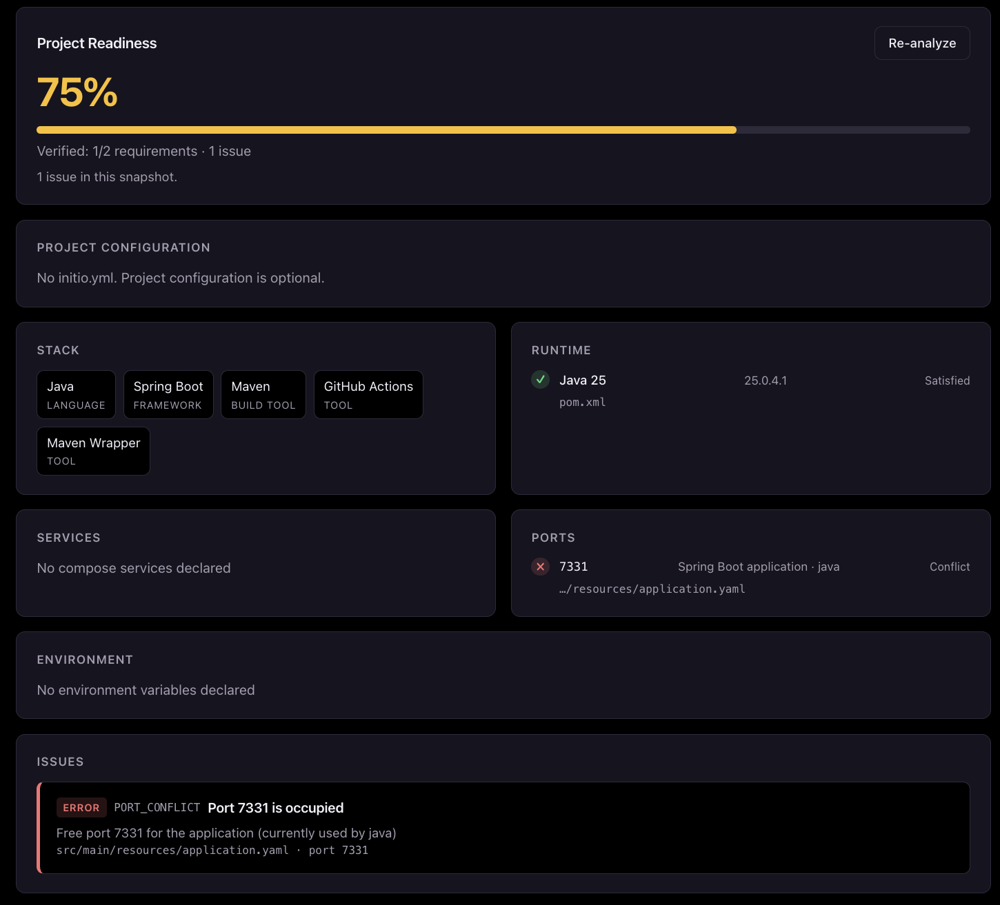

# Initio

Local-first developer environment diagnostic and project onboarding tool.

Initio reads a repository, works out what it needs to run, checks that against your machine, and tells you what's missing. No cloning, no build setup, no Java installation — it ships as a single native executable.

```bash
cd ~/Projects/my-app

initio check
```

```
INITIO

Project: Spring Maven Demo
Path: /Users/you/Projects/my-app

Detected stack
────────────────────────
Java
Spring Boot
Maven

Declared requirements
────────────────────────
Java 25 · pom.xml

Runtime
────────────────────────
✓ Java 25 — installed (25.0.2) · pom.xml

Result
────────────────────────
Project readiness: 100%
Verified: 2/2 requirements
No issues detected.
```

The same analysis is also available as a local web dashboard (`initio dashboard`), with light and dark themes:



## Install

### Homebrew (macOS / Linux)

```bash
brew install MoHussain543/tap/initio
initio --version
```

### Direct download

For Windows, or if you'd rather not use Homebrew, download the archive for your platform from the [latest release](https://github.com/MoHussain543/Initio/releases/latest):

| Platform | Archive |
| --- | --- |
| macOS (Apple Silicon) | `initio-<version>-macos-arm64.tar.gz` |
| macOS (Intel) | `initio-<version>-macos-x64.tar.gz` |
| Linux (x64) | `initio-<version>-linux-x64.tar.gz` |
| Windows (x64) | `initio-<version>-windows-x64.zip` |

**macOS / Linux**

```bash
tar -xzf initio-<version>-<platform>.tar.gz
sudo mv initio /usr/local/bin/
initio --version
```

On macOS, the binary is not yet code-signed, so Gatekeeper will block the first run with "cannot be verified". Clear the quarantine flag once:

```bash
xattr -d com.apple.quarantine /usr/local/bin/initio
```

**Windows**

Extract the `.zip`, then move `initio.exe` somewhere on your `PATH` and run `initio --version`. SmartScreen may warn on first run because the binary is not yet code-signed.

### Verify the download

Each release includes a `SHA256SUMS` file:

```bash
sha256sum -c SHA256SUMS
```

On macOS, use `shasum -a 256 -c SHA256SUMS`.

## Quick start

```bash
cd ~/Projects/my-app

initio info       # what this project is built with
initio check      # declared requirements vs. your machine
initio doctor     # problems, with suggested fixes
initio tasks      # how to build, test, and run this project
```

For a browser view of the same analysis:

```bash
initio dashboard
```

Then open http://127.0.0.1:7331.

## Commands

| Command | Description |
| --- | --- |
| `initio info [path]` | Show detected project information — languages, frameworks, build tools, services, CI. |
| `initio check [path]` | Analyze the repository and show declared requirements against your local environment. |
| `initio doctor [path]` | List environment problems and suggested fixes, with a readiness score. |
| `initio tasks [path]` | List build, test, and run tasks detected in this repository. |
| `initio dashboard [path]` | Start the local web dashboard for one project. |
| `initio config validate [path]` | Validate an optional `initio.yml`. |

All commands default to the current directory when `path` is omitted.

`initio dashboard` accepts `--port` (default `7331`) and `--host` (default `127.0.0.1`).

`initio doctor` exits non-zero when it finds errors, so it works as a CI or pre-flight gate.

## What it detects

Initio reads what's already in the repository — it does not ask you to describe your project twice.

- **Java / Maven** — `pom.xml` for the declared Java version, Spring Boot, and conventional commands
- **Node** — `package.json` for the declared engine, package manager, and npm scripts
- **Spring Boot** — `application.yaml` / `application.properties` for server ports and required environment variables
- **Docker Compose** — services, images, and published host ports
- **GitHub Actions** — workflow files for the Java/Node versions and commands CI expects
- **Makefile** — targets you can run
- **Environment** — `.env` files and referenced variables

It then checks that against your machine: installed runtimes and versions, running Compose services, occupied ports, and present/missing environment variables.

## Optional configuration

Initio works with zero configuration. If detection misses something, add an `initio.yml` to the repository root:

```yaml
environment:
  required:
    - INTERNAL_API_KEY
    - STRIPE_SECRET_KEY

runtimes:
  java: "25"
  node: ">=22"

commands:
  - name: integration-tests
    category: TEST
    command: "./scripts/integration-test.sh"

services:
  - name: redis
    port: 6379

ignore:
  - "env:LEGACY_API_KEY"
  - "port:3001"
  - "rule:DECLARATION_DRIFT"
```

- `runtimes` accepts simple constraints: `25`, `>=22`, `21.x`, `^22`, `~22`
- `commands[].category` is one of `RUN`, `DEV`, `TEST`, `BUILD`, `OTHER`
- `ignore` suppresses diagnostics by `env:<NAME>`, `port:<number>`, or `rule:<RULE_ID>`, where `RULE_ID` is one of `MISSING_RUNTIME`, `INCOMPATIBLE_RUNTIME`, `MISSING_ENVIRONMENT_VARIABLE`, `DOCKER_UNAVAILABLE`, `MISSING_REQUIRED_SERVICE`, `PORT_CONFLICT`, `DECLARATION_DRIFT`

Configured values are treated as hints alongside what Initio detects, not as a replacement for it. Run `initio config validate` to check the file.

## Development

Requires JDK 25. Tests run on any JDK; building the native executable requires [GraalVM](https://www.graalvm.org/) 25.

```bash
./mvnw test                              # run the test suite
./mvnw spring-boot:run -Dspring-boot.run.arguments=check   # run from source
./mvnw -Pnative native:compile           # build target/initio (needs GraalVM)
```

Releases are built and published by [`.github/workflows/release.yml`](.github/workflows/release.yml) on version tags. See [`docs/RELEASING.md`](docs/RELEASING.md) for the full release process, including the manual Homebrew tap update.

## License

[MIT](LICENSE)
